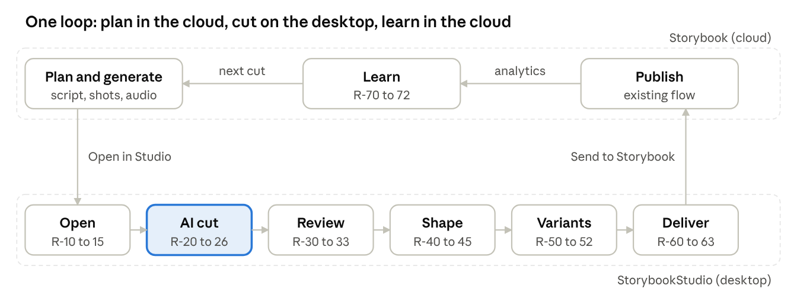
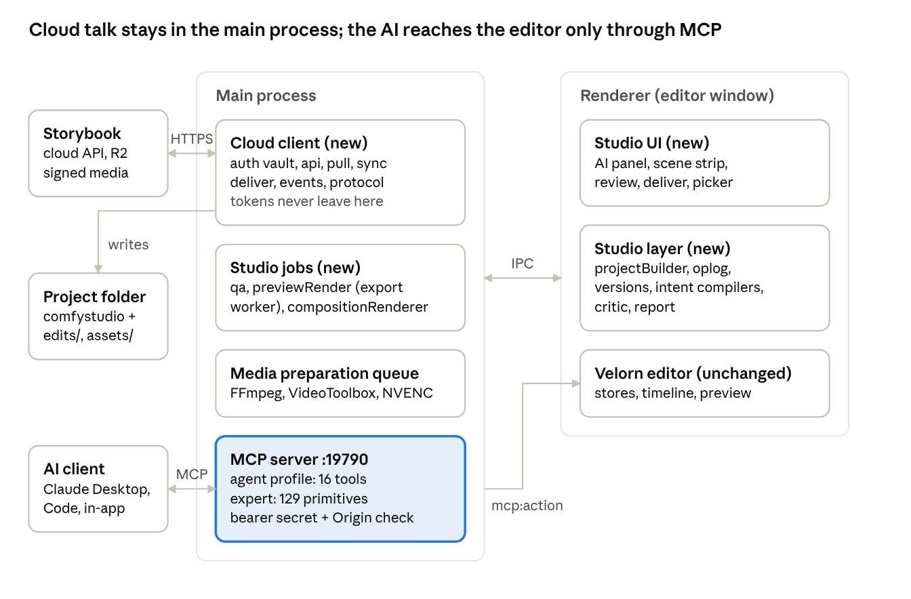

# StorybookStudio: PRD and EDD

Oct 3, 2026 · Shaurya

Part 1 is the product requirements, organised around the closed user loop. Part 2 is the engineering design for the StorybookStudio fork (the desktop app). Part 3 is the engineering design for the Storybook codebase (the web app). Part 4 ties the two into one closed loop.

# Part 1: Product requirements

## Product statement

**StorybookStudio is the desktop editing half of Storybook: an AI-operated video editor that runs on the creator's own computer, takes a planned episode from the cloud, cuts it, checks it, and sends a publish-ready result back.** Storybook stays where ideas, scripts, generation, publishing and analytics live. The Studio is where pixels and audio get worked on.

Why a desktop app and not a cloud editor:

|  | On the creator's computer | In the cloud |
| --- | --- | --- |
| Decode, scrub, render | Free. A laptop GPU with NVENC or VideoToolbox renders a 90 s 1080p cut in under a minute | Billed per minute of GPU, per render, per variant, per language |
| Iteration | The AI can render, look, and re-render dozens of times for nothing | Every critic pass costs money, so loops get rationed |
| Media | Pulled once, cached locally with proxies | Streamed on every scrub |
| Working offline | Edit on a plane, sync on landing | No |
| What stays in the cloud | Script, shots, generated media, brand, publishing, analytics, the record of what was edited |  |

The cloud still does what only the cloud does well: generation, storage, team sharing, publishing, analytics, and the memory of every edit. The desktop does what a desktop does cheaply: compute. Users get the capability of a cloud product and the cost of a local one.

**One sentence a user should be able to say:** *"Open episode 3, cut it to 90 seconds for YouTube, open with the strongest line, keep the music under the dialogue, our caption style, a CTA in the last 10 seconds, and give me the Shorts and the Hindi version too."* The Studio does it, shows what it changed and why, and asks for approval before anything leaves the machine.

## Users and jobs

The Studio serves the same people Storybook already serves. Nobody in the first three rows is a trained editor, and the product must not require them to become one.

| User | Today in Storybook | Job the Studio must do | What "done" looks like to them |
| --- | --- | --- | --- |
| Solo creator (YouTube, TikTok) | Plans and generates an episode, uploads clips, copies prompts, publishes | Turn the episode into a finished video and its Shorts without learning an NLE | Clicks "Open in Studio", types one instruction, approves, publishes. Under 30 minutes per episode |
| Indie filmmaker | Uses the screenplay and shot list seriously, wants control | A real timeline when they want it, an AI assistant when they don't | Can override any AI decision by hand. The AI never undoes a human change silently |
| Agency producer | Runs several projects and clients, cares about brand and languages | Consistent brand output across episodes, languages and formats, with a review step | Brand preset applied automatically. Reviewer approves in Storybook, not in the editor |
| Team editor (viewer or member role) | Invited into a project | Edit what they are allowed to, nothing more | Roles from Storybook carry over. A viewer can open and preview but cannot deliver |
| The AI agent | Storybook's agent skills plan stories and shots | Operate the whole editor without UI or timeline coordinates | Has a short list of intent-level capabilities, sees its own render, repairs its own QA failures |

**Jobs to be done, in the user's words**

1. "Get me from a generated episode to a video I would actually post."
2. "Make it the right length and shape for each platform without re-editing."
3. "Keep it looking like *us* every time."
4. "Tell me what you changed and let me take any of it back."
5. "Fix the shot that came out wrong without me rebuilding the edit."
6. "Give me the same video in Hindi and Spanish."
7. "Use what performed well last time."

## The closed user loop

The user moves through nine stages. Three happen in Storybook, six in the Studio, and the loop closes when analytics feed the next cut. The requirement IDs on each stage are defined in the next section.



&#91;embedded content: The closed user loop: 3 cloud stages, 6 desktop stages\]

Two crossings matter most. "Open in Studio" must deliver a rough cut, not a media bin, or the user is doing an editor's job. "Send to Storybook" must deliver a publish-ready package, not a file, or the user is doing a producer's job.

## Functional requirements by loop stage

Every requirement sits on one stage of the loop. P0 is the MVP, P1 is v1, P2 is v2. Requirement IDs (R-xx) are referenced by the EDD parts.

**Stage 1: Connect**

| ID | Requirement | Priority |
| --- | --- | --- |
| R-01 | Sign in to Storybook from the Studio with a browser login. Fallback: paste a token created in Storybook settings | P0 (token), P1 (browser) |
| R-02 | The Studio shows the signed-in user, workspace and projects they can see. Roles come from Storybook: viewer can open and preview, member can edit and deliver, admin can also publish | P0 |
| R-03 | A workspace admin can revoke a device from Storybook, and the Studio loses access within a minute | P1 |

**Stage 2: Open**

| ID | Requirement | Priority |
| --- | --- | --- |
| R-10 | "Open in Studio" on an episode page in Storybook launches the Studio on that episode. If not installed, a download page | P1 |
| R-11 | Picker inside the Studio: project → season → episode, with status, duration, last changed, and "already on this machine" | P0 |
| R-12 | Opening pulls every shot, dialogue line, music, SFX, caption, character reference and the screenplay into a local project folder, with progress and resume | P0 |
| R-13 | The episode opens as a **rough cut**: shots placed by their planned times, dialogue aligned, music under, captions on, a marker per scene. Never an empty timeline | P0 |
| R-14 | Shots regenerated in Storybook after the pull show as "updates available". Accepting replaces the media in place and keeps the user's edit | P1 |
| R-15 | The project opens and plays offline once pulled | P0 |

**Stage 3: AI cut**

| ID | Requirement | Priority |
| --- | --- | --- |
| R-20 | A chat panel where the user gives an instruction in plain language. The AI answers with a per-scene plan before touching anything | P0 |
| R-21 | Intents the AI must handle: hit a target duration, tighten pacing, remove dead air, open with the strongest line, keep music under dialogue, add captions, add B-roll where it adds information, emphasise a statement, add a CTA, match brand | P0 (first 7), P1 (rest) |
| R-22 | Every applied plan creates a named version. The user can return to any version | P0 |
| R-23 | The AI renders a preview of what it changed, checks it, and fixes its own technical failures (audio levels, black frames, caption overlaps) before showing the user | P1 |
| R-24 | An **explain-why report** for every plan: what was removed, changed, added, the reason, and the expected effect ("Scene 3: 17.4 s → 12.8 s") | P0 |
| R-25 | An edit policy per project (min/max shot length, allowed transitions, music and caption defaults) that the AI follows every run | P1 |
| R-26 | The AI works with Claude Desktop or Claude Code over MCP, and with the Studio's built-in agent. Same capabilities in both | P0 |

**Stage 4: Review**

| ID | Requirement | Priority |
| --- | --- | --- |
| R-30 | Side-by-side: the timeline before and after a plan, with changed clips highlighted. Accept all, accept per scene, or reject | P0 |
| R-31 | A hand edit is never overwritten by the AI. The AI's next plan starts from the user's current state | P0 |
| R-32 | Undo any AI change with one click, even after restarting the app | P0 |
| R-33 | "Why this?" on any clip shows the reason from the report | P1 |

**Stage 5: Shape (hand editing, audio, captions, graphics)**

| ID | Requirement | Priority |
| --- | --- | --- |
| R-40 | The full upstream editor remains available: trims, moves, splits, speed, transitions, keyframes, text, shapes, effects | P0 |
| R-41 | Audio buses: dialogue, music, SFX, ambience, master with a limiter. Ducking under dialogue by default. Loudness normalised to the platform target | P1 |
| R-42 | Captions from local transcription, styled by the brand preset, inside safe areas for each aspect ratio | P0 (captions), P1 (brand style) |
| R-43 | Graphics by instruction: counters, callouts, lower thirds, charts, maps, timelines. "At 32 s show a counter to 87" produces a graphic, not keyframes | P2 |
| R-44 | Brand presets from Storybook: fonts, colours, caption style, logo, intro/outro, transition and music style | P1 |
| R-45 | Semantic effects: punch-in, Ken Burns, speed ramp, freeze frame, colour grade | P2 |

**Stage 6: Variants**

| ID | Requirement | Priority |
| --- | --- | --- |
| R-50 | Shorts: from Storybook's shorts candidates or the AI's own hook pick, a 9:16 cut with subject-tracking reframe and captions | P1 |
| R-51 | Language versions: one master edit, dialogue and captions per language, graphics text that refits, one render per language | P2 |
| R-52 | Hook variants: alternative first 5 seconds exported as separate files for Storybook's hook tests | P2 |

**Stage 7: Deliver**

| ID | Requirement | Priority |
| --- | --- | --- |
| R-60 | Delivery presets: YouTube 16:9, Shorts, TikTok, Reels, 1:1, master | P0 (YouTube + Shorts), P1 (rest) |
| R-61 | Automated QA before delivery: codec, duration against target, loudness, clipping, black or frozen frames, caption timing and safe areas, script coverage. A QA badge per render | P1 |
| R-62 | "Send to Storybook" uploads renders, captions, thumbnail, QA results and the explain-why summary, and sets the episode to Ready. Always confirmed by the user first | P0 |
| R-63 | Local export to a file always works, with or without Storybook | P0 |

**Stage 8: Learn**

| ID | Requirement | Priority |
| --- | --- | --- |
| R-70 | The episode in Storybook shows how it was edited: versions, duration, AI versus hand changes, and the report | P1 |
| R-71 | Retention drop-offs from Storybook analytics appear as markers on the timeline when re-opening a published episode, with a "re-cut around these" intent | P2 |
| R-72 | Edit style signals (average shot length, cut density, hook type) flow into Storybook's content analytics | P2 |

## AI editor behaviour

The AI is a collaborator that proposes, shows, applies on approval, checks its own work, and explains. These rules hold regardless of which model or client drives it.

**What the user can say** (examples the product must handle, each maps to R-21)

| Instruction | What the AI does |
| --- | --- |
| "Make it 90 seconds" | Reads the script and shot purposes, cuts low-information shots first, keeps every scene represented, reports the per-scene change |
| "Tighten scene 3" | Removes silence, trims reactions after the information lands, drops duplicate B-roll, shortens transitions |
| "Open with the strongest line" | Finds the sound bite with the highest importance and clarity, moves it to 0:00, adjusts the scene order around it |
| "Keep the music under the dialogue" | Sets ducking on the music bus, checks loudness per segment, reports where it still masks |
| "Add captions in our style" | Transcribes, applies the brand caption preset, checks safe areas for the target aspect |
| "Add a CTA in the last 10 seconds" | Adds a brand end card or lower third, ducks music, aligns to the final dialogue |
| "Give me the Shorts" | Picks the hook, builds a 9:16 timeline with reframe and captions, renders and QA-checks it |
| "Undo what you did to the intro" | Restores the version before that plan, scene-scoped |

**What the AI must always do**

1. Inspect before planning: read the script, scene map, timeline and media health.
2. Show a plan before applying. The plan is per scene, in plain language, with the expected duration change.
3. Create a version before applying. Apply only on approval, except inside its own QA-repair loop, which stays inside a draft version until shown.
4. After applying, render a preview and run QA. Fix technical failures itself. Surface creative judgments to the user.
5. Explain every change with a reason tied to the script, the policy or the QA result.
6. Never touch a clip the user edited by hand since the last plan without saying so.
7. Never deliver, publish or upload without an explicit confirmation on a summary that names the episode, the files and the destination.

**The explain-why report** (R-24), the format every plan produces:

```text
Plan: "Make it 90 seconds"            Version: AI cut v2 (from Rough cut)
Duration: 128.4 s -> 91.2 s           Target: 90 s   Scenes kept: 6 of 6

Scene 1  24.1 s -> 18.0 s
  Trimmed  Shot 1.2  4.8 s -> 3.2 s   Information already given by dialogue
  Removed  Shot 1.4  2.1 s            Duplicate establishing shot
Scene 3  31.0 s -> 20.5 s
  Removed  silence  1.2 s             Dead air before line 7
  Moved    Shot 3.5 -> 0:00           Strongest sound bite, used as the hook
Audio     Music -8 dB under dialogue  Dialogue was masked at 0:42-0:47
QA        Loudness -14 LUFS  OK   Black frames 0   Captions in safe area  OK
```

## Screens and interaction model

Five surfaces. The upstream editor itself is one of them, unchanged in its essentials. The rest wrap it.

| Screen | Purpose | Key elements |
| --- | --- | --- |
| Welcome | Start from Storybook or from a local project | "Open from Storybook" (signed in: episode picker; not: sign-in), recent projects, "Updates available" badges |
| Episode picker | Choose what to open | Project → season → episode tree, status chips (`storyboard`, `generating`, `editing`, `ready`), size estimate, "On this machine" |
| Editor | The upstream editor's timeline, preview, assets, with two additions | **AI panel** on the right (instruction box, plan cards per scene, Approve / Approve scene / Reject, report), **scene strip** above the timeline showing scene headings and target vs actual duration |
| Review | Compare before and after a plan | Two timelines stacked, changed clips highlighted, scrub both in sync, per-scene accept, "Why this?" popover on any clip |
| Deliver | Choose formats, see QA, send | Preset checklist, per-render QA badge with issues listed, "Fix with AI" on each issue, "Send to Storybook" with a confirmation summary, "Export to file" |

**Interaction rules**

- The AI panel never blocks the editor. The user can hand-edit while a plan is being prepared; the plan then re-bases on the current state before it is shown.
- Plan cards are the unit of approval. A card names the scene, the duration change and the changes in one line each.
- The scene strip is the user's map. Clicking a scene selects its clips and scopes the next instruction to it ("tighten this").
- Anything leaving the machine (Send to Storybook) shows a confirmation naming the episode, the files, their sizes and the destination workspace.
- The in-app agent and an external MCP client (Claude Desktop, Claude Code) produce the same plan cards in the same panel, so the user sees AI activity in one place no matter where it originates.

## Non-functional requirements

| Area | Requirement |
| --- | --- |
| Open time | A 20-shot episode (about 1.5 GB) opens as a rough cut in under 2 minutes on a 100 Mbps connection. Playback is ready before all proxies finish |
| Edit latency | A plan preview appears within 20 s for a 10-minute episode. Apply is under 2 s |
| Preview render | A scene preview at 720p renders faster than real time on a 2020 MacBook Air (M1) or an RTX 3060 laptop |
| Final render | 1080p at 1× real time or faster with hardware encode (VideoToolbox, NVENC). Software fallback must still complete |
| Offline | Everything except pull, re-sync and Send works offline. Hosted-model AI needs a connection; the local-model agent does not |
| Hardware floor | macOS 13+ on Apple Silicon or Intel, Windows 10+ with a GPU. 8 GB RAM minimum, 16 GB recommended |
| Storage | Projects live in a user-chosen folder. Media is cached once per episode. A "Free space" action removes caches and proxies but keeps the edit |
| Privacy | Media stays on the machine unless the user sends a render. Vision analysis for the critic uses keyframes only, and the user can choose local-only analysis |
| Reliability | Autosave every 30 s, checkpoints before every AI plan, versions survive crashes and restarts |
| Security | Tokens encrypted at rest with the OS keychain. The local AI connection requires a per-install secret. Nothing listens beyond localhost |
| Accessibility | Keyboard operation of the AI panel and review screen. Captions and reports readable by screen readers |

## Success metrics

The product works when an episode goes from Storybook to published without the creator opening a timeline, and when they do open it, the AI's work survives.

| Metric | Target at v1 | How measured |
| --- | --- | --- |
| Time from "Open in Studio" to "Sent to Storybook" | Median under 30 minutes | Studio events in Storybook |
| Episodes delivered with zero hand edits | 40% | Op log: share of versions with no manual operations |
| AI plan approval rate (first plan accepted without rejection) | 60% | Plan card outcomes |
| QA pass on first delivery render | 90% | Delivery package QA field |
| Share of published episodes edited in the Studio | 70% of Storybook publishes within 6 months | `episodes.metadata.editedIn` |
| Variants per episode (Shorts, languages) | 2.5 average | Renders per episode |
| AI cost per delivered episode | Under $1 hosted, $0 local | Token accounting per plan |
| Rollbacks after approval | Under 10% of plans | Version restores |

## Non-goals and release scope

**Non-goals**

- Real-time collaborative editing between two Studios or between web and desktop.
- A timeline editor in the browser. Storybook reviews and publishes; it does not edit.
- Cloud rendering as the default. It may come later as an option for machines below the hardware floor.
- Generating video inside the Studio. Generation stays in Storybook (or ComfyUI for users who have it). The Studio asks Storybook to regenerate.
- Replacing the upstream editor's UI. The fork adds around it.

**Release scope**

| Release | Includes | Loop closed? |
| --- | --- | --- |
| MVP | R-01 (token), R-02, R-11 to R-13, R-15, R-20 to R-22, R-24, R-26, R-30 to R-32, R-40, R-42 (captions), R-60 (YouTube + Shorts preset), R-62, R-63 | Open → AI cut → Review → Deliver, by hand-confirmed upload |
| v1 | Browser sign-in, R-03, R-10, R-14, R-23, R-25, R-33, R-41, R-42 (brand), R-44, R-50, R-60 (all), R-61, R-70 | Full loop including Learn (edit record in Storybook) |
| v2 | R-43, R-45, R-51, R-52, R-71, R-72, cloud render option | Analytics feed back into the next cut |

## How the PRD flows into the EDD

Each requirement is delivered by one owning component. **Fork** means Part 2 (StorybookStudio desktop); **SB** means Part 3 (Storybook web app). Shared rows need both.

| Requirements | Owner | Component in the EDD |
| --- | --- | --- |
| R-01, R-03 | SB + Fork | Desktop tokens and OAuth PKCE (Part 3 Auth); auth vault (Part 2 Cloud client) |
| R-02 | SB | `/api/v1/me`, project role checks (Part 3 API, Auth) |
| R-10 | SB + Fork | "Open in Studio" button (Part 3 UI); `storybookstudio://` protocol handler (Part 2 Cloud client) |
| R-11, R-12, R-15 | SB + Fork | Edit package endpoint (Part 3 API); pull job and project builder (Part 2 Cloud client, Project format) |
| R-13 | Fork | Project builder: rough-cut assembly rules (Part 2 Project format) |
| R-14 | SB + Fork | Package `etag` and per-shot hashes (Part 3 API); re-sync (Part 2 Cloud client) |
| R-20, R-21, R-26 | Fork | Capability tools and intent compiler (Part 2 Agent interface) |
| R-22, R-31, R-32 | Fork | Operation log and versions (Part 2 Project format) |
| R-23, R-61 | Fork | Render, QA and critic pipeline (Part 2) |
| R-24, R-33 | Fork | Explain-why report generated from the op log (Part 2 Agent interface) |
| R-25, R-44 | SB + Fork | Edit policy and brand package in the edit package (Part 3 Data model, API); applied by the compiler and caption styler (Part 2) |
| R-30 | Fork | Review screen over versions (Part 2 Desktop architecture) |
| R-40 | Fork | Upstream editor, unchanged (Part 2 Fork strategy) |
| R-41, R-42 | Fork | Audio buses and captions (Part 2 Audio, captions, compositions) |
| R-43, R-45 | Fork | Composition clips and semantic effects (Part 2 Audio, captions, compositions) |
| R-50, R-52 | Fork | Variant timelines, reframe, delivery batch (Part 2 Render pipeline) |
| R-51 | SB + Fork | Language lanes (Part 2); localization orchestration with ElevenLabs (Part 3 Workers) |
| R-60, R-63 | Fork | Delivery presets and export (Part 2 Render pipeline) |
| R-62, R-70 | SB + Fork | Delivery package upload (Part 2 Cloud client); `episode_renders`, finalize endpoint, status machine, edit record UI (Part 3) |
| R-71, R-72 | SB + Fork | Analytics markers in the edit package and edit events ingestion (Part 3 API, Workers); markers and intent (Part 2 Agent interface) |

# Part 2: EDD, the StorybookStudio fork (desktop)

## Fork strategy

**StorybookStudio is the upstream editor plus a `studio/` layer. Upstream files change only at registration points, so upstream merges stay routine.** The upstream editor is Electron 28, React 18, Vite, Zustand, with bundled FFmpeg and ffprobe, and a 14.8k-line MCP server. All of that is kept.

| Kept from upstream as is | Added by the fork | Changed in place (small, registration only) |
| --- | --- | --- |
| Timeline, preview, assets, export UI (`src/components/*`) | `electron/studio/` (cloud client, auth vault, pull job, render/QA pipeline, Remotion renderer) | `electron/main.js`: protocol handler, single-instance lock, `studio:*` IPC, MCP auth wiring |
| Stores (`projectStore`, `timelineStore`, `assetsStore`) | `src/studio/` (project builder, op log, versions, intent compiler, report generator, AI panel, review screen, deliver screen) | `electron/preload.js`: expose `electronAPI.studio.*` |
| 129 MCP tools and the renderer action bridge (`mcpActions.js`) | Capability tools registered as a second MCP profile | `electron/mcpServer.js`: tool profile switch, bearer check, Origin check |
| Captions (whisper.cpp), audio graph, hardware export, media preparation queue | Audio buses, caption brand styling, composition clip type, language lanes | `src/App.jsx`: mount the AI panel and scene strip; `package.json`: protocol registration, product name |
| Project folder format and autosave | Additive fields in `project.storybookstudio`, plus `edits/` and `storybook/` folders | `docs/MCP.md`: document new tools and auth |

**Naming:** StorybookStudio everywhere a user or another program sees it: product and package name, app id, deep-link scheme `storybookstudio://`, file protocol `storybookstudio-file://`, project file `project.storybookstudio` (the loader still opens the upstream extension and renames it on save). The upstream name appears only in the Open-source licenses view, which GPL-3.0 §5 requires (owner, 2026-10-05; this reverses the first draft's rule of keeping the upstream internal identifiers).

**Upstream cadence:** merge upstream monthly. Two changes (MCP auth, the `storybookstudio-file://` path allowlist) are offered upstream as PRs so the fork carries less.

**License:** The upstream editor is GPL-3.0-only. The fork is GPL too. Storybook's server code is a separate program communicating over HTTP, which keeps it outside the GPL boundary. If the fork is distributed to customers, its source is published; the repo is public from day one to make this a non-event.

## Desktop architecture

The upstream editor's Electron shape is kept: a main process that owns the filesystem, FFmpeg, jobs and the MCP server, and a renderer that owns the editor state. The fork adds a cloud client and job modules in main, and a studio layer plus five UI surfaces in the renderer.



&#91;embedded content: Desktop architecture: main process, renderer, MCP server and the new studio modules\]

The renderer opens and saves the project folder as the upstream editor always has. The cloud client writes into that same folder on pull and reads from it on deliver. The MCP server reaches the editor through the existing `mcp:action` bridge, which is why every AI change goes through the stores' normal undo, dirty tracking and autosave.

## Project format: EditGraph v1

**EditGraph v1 is the upstream editor's project file (`project.storybookstudio` in the fork) with four additive fields, an append-only operation log, and named versions.** Existing upstream projects open unchanged; a Studio project opens in the stock upstream editor with the extra fields ignored.

**Folder**

```text
<Project> - E03 <Episode title>/
  project.storybookstudio          upstream project JSON + EditGraph fields
  assets/video/s01_sh02_<id8>.mp4
  assets/audio/dialogue/<lang>/s01_l07_MAYA.mp3
  assets/audio/music/  assets/audio/sfx/  assets/audio/ambience/
  assets/images/frames/  assets/images/characters/
  captions/<lang>.srt
  compositions/<compositionId>-<propsHash>.webm   rendered graphics (cache)
  edits/oplog.jsonl             every operation, append-only
  edits/versions.json           named versions -> op ranges
  edits/reports/<versionId>.json  explain-why reports
  storybook/package.json        edit package as pulled (etag, ids, hashes)
  storybook/link.json           {apiBase, projectId, episodeId, pulledAt}
  storybook/brand.json  storybook/policy.json
  renders/  autosave/  cache/
```

**Additive fields on existing objects**

```json
// asset (assetsStore)
{ "id": "asset_...", "path": "assets/video/s01_sh02_9f3a1c2d.mp4",
  "role": "generated_video",            // taxonomy enum
  "semantic": { "scene": 1, "shotId": "...", "characters": ["Maya"],
                "purpose": "reaction", "emotion": "surprised",
                "prompt": "...", "continuationFrom": "shot_..." },
  "analysis": { "loudnessLufs": -18.2, "silences": [[0.0,0.4]], "bpm": null,
                "keyframes": ["cache/kf/....jpg"], "semanticsVersion": 1 },
  "languageDependency": "none" }       // none | language | locale

// clip (timelineStore)
{ "id": "clip-12", "assetId": "asset_...", "trackId": "video-1",
  "metadata": { "semantic": { "scene": 1, "shotId": "...", "role": "primary_video" },
                "origin": { "versionId": "v2", "opId": 418, "by": "ai" } } }

// timeline
{ "id": "tl-master", "name": "Master", "studio": { "kind": "master" | "variant",
  "variantOf": "tl-master", "aspect": "9:16", "language": "en" } }

// project root
{ "studio": { "schema": "editgraph/1", "episodeId": "...", "currentVersion": "v2",
              "audioBuses": { "dialogue": {...}, "music": {"duckUnder": "dialogue", "duckDb": -8}, "master": {"limiterLufs": -14} } } }
```

**Asset role taxonomy:** `primary_video, broll, reaction, establishing, generated_video, stock_video, overlay_video, dialogue, voiceover, soundbite, music, ambience, sfx, caption, title, lower_third, logo, image, composition`. Filled from Storybook types where known (shot → `generated_video`, dialogue line → `dialogue`, `audio_tracks.type` → `music | sfx | ambience`) and by analysis otherwise.

**Sound bites and music metadata:** `SoundBite {id, assetId, transcript, speaker, inPoint, outPoint, importance, topics, loudnessLufs, silenceBefore, silenceAfter}` built from whisper word timings; `MusicAsset {bpm, energy, mood[], introDuration, outroDuration, loopable, beats[]}` from analysis. Both live in `analysis`.

**Operation log** (`edits/oplog.jsonl`, one line per applied MCP action)

```json
{"op":418,"ts":"2026-10-03T10:41:12Z","by":"ai","session":"plan-7","tool":"trim_clips",
 "args":{"clipIds":["clip-12"],"trimEnd":1.6},"inverse":{"tool":"trim_clips","args":{...}},
 "reason":"Information already given by dialogue","scene":1,"versionId":"v2"}
```

The log is written by a wrapper around `runMcpAction` and around the renderer's own store actions for hand edits (`by: "user"`). The upstream editor's in-memory undo stays as the fast path; the log is the durable one. `versions.json` maps `{id, name, parent, opRange:[from,to], createdBy, prompt, timelineSnapshotPath}`; a snapshot is taken at each version boundary so restore is O(1) rather than a replay.

**Current timeline = version snapshot + ops since.** Restore a version by loading its snapshot. "What did the AI change?" is a filter on the log. Diff for the review screen is computed from clip `origin` fields.

## Agent interface

**The agent sees 16 capability tools. Those compile to plans over the upstream editor's 129 primitives, which stay available in an expert profile.** Both profiles are served by the same MCP server (`electron/mcpServer.js`, HTTP JSON-RPC on `127.0.0.1:19790/mcp`), selected by a `profile` query parameter or header: `agent` (default) or `expert`.

**Capability tools (`agent` profile)**

| Category | Tool | Input | Output |
| --- | --- | --- | --- |
| Lifecycle | `studio_open_episode` | `{episodeId}` or picker | job id, then project opened |
|  | `studio_check_readiness` |  | media, codecs, durations, captions, policy, target: pass or issues |
|  | `studio_create_version` / `studio_restore_version` | `{name}` / `{versionId}` | version |
|  | `studio_deliver` | `{presets[], languages[], confirm:false}` | preview summary; `confirm:true` renders and uploads |
| Perception | `studio_get_context` | `{scope?}` | script, scene map, policy, brand, timeline summary, QA state. The one call the agent makes first |
|  | `studio_search_assets` | `{query, role?, scene?, durationRange?}` | ranked assets with semantics |
|  | `studio_review` | `{scope, versionId?}` | critic findings: pacing, audio, visual, narrative, each scored |
| Editing | `studio_edit` | `{intent, scope, params?, previewOnly:true}` | plan cards and report; `previewOnly:false` applies into a new version |
|  | `studio_edit_audio` | `{intent: balance, duck, normalize, fade; scope}` | same |
|  | `studio_add_captions` | `{language, style?}` | same |
|  | `studio_add_graphic` | `{kind, text, at, duration, anchor?}` | composition clip |
|  | `studio_create_variant` | `{kind: short, language, hook; params}` | new variant timeline |
|  | `studio_repair` | `{issues[]}` from review or QA | plan over fixes |
| Render | `studio_render_preview` | `{scope: scene, range, timeline; quality}` | file path, QA result, keyframe paths for vision |
| Storybook | `studio_check_updates` / `studio_apply_updates` |  | changed shots; replacement plan |

**Intents for `studio_edit`:** `hit_duration, tighten_pacing, remove_dead_air, open_with_strongest_line, keep_music_under_dialogue, add_broll, emphasize, add_cta, match_brand, reorder_scenes`. Each intent is an **intent compiler** in `src/studio/intents/<intent>.js`: `(context, scope, params, policy) => ActionPlan`, where `ActionPlan` is the existing `run_mcp_action_plan` shape (up to 50 primitive steps, `createCheckpointFirst: true`) plus a `reasons[]` array aligned to steps. Preview runs the plan through the primitives' own `previewOnly` path and renders plan cards from `reasons`.

Example, `tighten_pacing(scene 3)` compiles to: `find_timeline_items(scene 3)` → `detect_silence` on dialogue clips → `trim_clips` for silences over 0.6 s → `inspect_visible_shots` for duplicate establishing shots → `delete_clips` → `trim_clips` on reaction shots to policy max → `update_transition` to policy max duration. Every step carries a reason string that becomes the report line.

**Explain-why report:** generated from the plan's `reasons[]` and the op log diff (`edits/reports/<versionId>.json`), rendered to the text block shown in the PRD. The same JSON goes into the delivery package.

**Edit policy** (`storybook/policy.json`, from Storybook or defaults): `{targetDuration, minShotLength, maxShotLength, transitions:{preferred[], maxDuration}, music:{duckUnderDialogue, duckDb}, captions:{enabled, style}, visual:{avoidRepeatedShots, avoidExtremeZoom}}`. Compilers read it; the critic checks against it.

**In-app agent:** `src/services/agentTools.js` already drives primitives from a local model via fenced `storybookstudio-tool` blocks. It is pointed at the capability profile, so the built-in agent and an external Claude client have identical powers and produce identical plan cards.

## Render, QA and critic pipeline

**The AI sees its own work through a local preview render, a deterministic QA pass and a critic pass. All three run on the user's GPU, so iteration is free.** The upstream editor's export path (hidden worker window, canvas compositing, FFmpeg frame pipe, hardware encoders in `hardwareExportFfmpeg.js`) is reused for every tier.

| Tier | Settings | When | Typical time (M1 Air, 90 s cut) |
| --- | --- | --- | --- |
| Keyframes | 1 JPEG per cut and per 2 s, 640 px | After every applied plan | 3 s |
| Scene preview | 720p, 24 fps, H.264 fast, from proxies | Critic pass, scoped to changed scenes | 10 s per 20 s scene |
| Audio-only | WAV mix of the buses | Loudness and masking checks | 2 s |
| Review render | 720p full timeline | Before the user reviews (R-30) | 40 s |
| Delivery | Preset resolution, hardware encode, loudness-normalised | `studio_deliver` | 60 to 90 s |

**Deterministic QA** (`electron/studio/qa.js`, all FFmpeg filters and ffprobe, no model):

| Check | Tool | Threshold from |
| --- | --- | --- |
| Loudness and true peak | `ebur128` | preset (`-14 LUFS` YouTube, `-16` Reels) |
| Clipping | `astats` | fixed |
| Black, frozen frames | `blackdetect`, `freezedetect` | fixed |
| Silence longer than policy | `silencedetect` | policy |
| Duration vs target | ffprobe | policy `targetDuration` ± 5% |
| Codec, fps, resolution | ffprobe | preset |
| Caption timing and safe area | caption cues vs preset safe rectangles | preset |
| Missing or offline media | asset health (`check_media_health`) | fixed |
| Script coverage | scene map vs clips: every scene has at least one clip, every dialogue line present or deliberately cut | fixed |

Output is `{pass, issues:[{type, severity, timeRange, scene, detail, repairIntent?}]}`. Each issue names the `studio_repair` intent that fixes it, so repair is a plan, not a prompt.

**Critic** (`src/studio/critic/`): runs after QA on keyframes, the audio mix and the scene map. Three analysers, each returning scored issues in the same shape:

- *Pacing*: shot lengths vs policy, information delivery (dialogue end vs clip end), repeated shots, cut density per scene.
- *Audio*: dialogue-to-music ratio per segment from the bus stems, fades at cuts, abrupt level changes.
- *Visual and narrative*: a vision model on keyframes checks subject framing, caption overlap, continuity across cuts (last frame of A vs first frame of B); script fidelity compares the scene map to the screenplay.

The vision step is the only one that costs tokens. It runs on keyframes, not video, and is capped at 40 images per review. With no hosted model configured, the critic runs the first two analysers only.

**Loop control:** `studio_edit` with `autoRepair:true` runs apply → keyframes → QA → repair up to 3 times inside a draft version. Only the final state is shown as plan cards; intermediate states are in the op log for the audit trail.

**Hardware policy:** VideoToolbox on macOS, NVENC on Windows and Linux, via the upstream editor's existing media-preparation queue (one encoder at a time, atomic publish). Software x264 fallback. Delivery renders go through the queue; preview renders bypass it so they are never blocked by a long export.

## Audio, captions, compositions and localization

**Audio buses** sit on top of the upstream editor's Web Audio preview graph (`audioMixerGraph.js`) and FFmpeg export mix (`export:mixAudio`). Each audio track gets a `bus` field; buses are `dialogue, music, sfx, ambience`, summed into `master` with a limiter. Ducking is a sidechain from the dialogue bus onto the music bus (gain `policy.music.duckDb`, 120 ms attack, 400 ms release), applied at preview as a Web Audio gain automation and at export as FFmpeg `sidechaincompress`. `studio_edit_audio` intents compile to `set_clip_audio`, `set_master_audio` and bus parameter changes. Bus stems are exported separately for localization.

**Captions** keep the upstream editor's path: whisper.cpp locally (`captionWhisper.js`) to word timings, cues on a `role:'captions'` track. Additions: a **caption style preset** from the brand package (font, size, colour, background, position, max chars per line, emphasis words), and **safe-area rules** per aspect ratio (9:16 keeps captions above the bottom 25% and clear of platform UI). `studio_add_captions` compiles to `transcribe_captions` → `update_caption_cues` with styling → QA safe-area check.

**Compositions (R-43, v2):** a new clip type `composition` with `{engine:'remotion', compositionId, props, languageDependency}`. Remotion is **not** a live renderer in the preview. `electron/studio/compositionRenderer.js` renders a composition to an alpha WebM via `@remotion/renderer` (bundled Chromium) keyed by `sha256(compositionId + props)`, stored under `compositions/`, and the clip plays that file through the upstream editor's existing overlay path. The preview shows a placeholder until the render lands (seconds). Graphics primitives (counter, callout, lower third, chart, map, timeline, progress bar) are Remotion components in `src/studio/compositions/` that read brand tokens. Remotion's company license applies above 3 employees; confirm before v2.

**Semantic effects (R-45):** `punch_in, ken_burns, speed_ramp, freeze_frame, color_grade` are compilers to existing primitives (`set_clip_keyframes`, `set_clip_speed`, `split_clip`, `add_glsl_effect`). No new render code.

**Localization (R-51, v2):** one master timeline. Dialogue and caption tracks carry `language`. A render selects a language: tracks matching it or `none` are included, others muted. Composition props with `languageDependency:'language'` take localized strings from `storybook/package.json` and refit (Remotion measures text and adjusts font size, wrapping, and duration within a tolerance). `studio_create_variant({kind:'language', language:'hi'})` imports the dubbed lines Storybook produced, places them by `timelineStart`, re-runs captions for that language, renders, and QA-checks language mismatch (whisper language detection on the mix).

## Cloud client

**All Storybook communication lives in the main process (`electron/studio/`). The renderer and MCP tools call `studio:*` IPC and never see a token.**

| Module | Responsibility |
| --- | --- |
| `auth.js` | PAT paste and OAuth PKCE flows. Tokens encrypted with Electron `safeStorage` in `userData/studio-auth.json`. Refresh 5 minutes before expiry. Emits `studio:auth-changed` |
| `api.js` | Typed client for `/api/v1/*` with retry, ETag caching, 401 → refresh → retry once, 403 → surface role error |
| `pull.js` | The pull job: fetch edit package → plan downloads → download with concurrency 4, HTTP range resume, sha256 verify → ffprobe each file → hand to the project builder → open. Progress via `studio:job-progress`. Idempotent: re-running skips verified files |
| `sync.js` | Re-sync: fetch package with `If-None-Match`; diff by shot `sha256` and dialogue ids; download changed media under new names; produce a replacement plan (`replace_clip_with_asset` per changed clip) for the AI panel. Never auto-applies |
| `deliver.js` | Builds the delivery package, requests presigned PUTs, uploads renders, captions, thumbnail, QA and report with resume, calls finalize |
| `events.js` | Batches edit events (plan proposed, approved, rejected, version created, delivered) and posts them to `/api/v1/episodes/{id}/events` every 60 s or on delivery. Off when offline, flushed on reconnect |
| `protocol.js` | `storybookstudio://open?api=&episode=` and `storybookstudio://auth/callback`. Registered via `app.setAsDefaultProtocolClient`, single-instance lock, `open-url` (macOS) and `second-instance` (Windows, Linux). Validates `api` against an allowlist of known Storybook hosts |

**Project builder** (`src/studio/projectBuilder.js`, pure, Electron-free, unit-tested): `(package, probedAssets, brand, policy) => projectJson`. Rules: one master timeline at the episode's aspect and fps; `video-1` for shots in `sequence_number` order at `timelineStart` or packed sequentially; `Dialogue` track per language; `Music`, `SFX`, `Ambience` tracks on their buses; a `captions` track from caption segments; one marker per scene named by heading; asset folders per scene; `semantic` on every clip and asset; Veo shot audio enabled on a `ShotAudio` track ducked under dialogue.

**Signed URLs** expire in 1 hour. The pull job re-fetches the package when a download returns 403 and resumes from the same byte offset.

## Security hardening of the fork

These ship before any cloud token is stored. Two are existing upstream gaps.

| Issue | Today | Change |
| --- | --- | --- |
| MCP server has no auth | Loopback bind only on `127.0.0.1:19790`. Any local process can drive edits | Per-install secret generated on first run into `userData`, required as `Authorization: Bearer` on every request. Shown once in Settings with a ready `claude mcp add` command. Requests with a non-loopback `Origin` or `Host` rejected |
| `storybookstudio-file://` file protocol serves any path | `registerFileProtocol` decodes the path and `net.fetch`s it with no restriction (`main.js` \~3509), despite a comment saying otherwise | Allowlist: the open project folder, `userData`, the caches directory. Anything else returns 403 |
| Tokens | None stored today | `safeStorage` only, main process only, never in renderer state, never in the MCP snapshot, redacted from logs |
| Deep link input | None today | `api` host allowlist, `episode` id format check, no automatic pull: the picker opens with the episode pre-selected and the user confirms |
| Uploads | None today | Only `studio_deliver` with `confirm:true`, which requires a confirmation summary shown in the UI; the MCP tool cannot bypass the UI confirmation |
| Checkpoints lost on restart | `MCP_PROJECT_CHECKPOINTS` in memory | Versions and snapshots on disk under `edits/` |

## Files to change in the StorybookStudio repo

| Path | New or changed | What |
| --- | --- | --- |
| `electron/studio/{auth,api,pull,sync,deliver,events,protocol}.js` | New | Cloud client as above |
| `electron/studio/{qa,previewRender,compositionRenderer}.js` | New | QA checks, preview tiers, Remotion render-to-asset |
| `electron/studio/mcpCapabilities.js` | New | The 16 capability tools, their schemas and the `profile` switch |
| `electron/mcpServer.js` | Changed | Register profiles, bearer and Origin checks, persisted checkpoints, op-log hook on every write tool |
| `electron/main.js` | Changed | Protocol handler, single-instance lock, `studio:*` IPC, `storybookstudio-file://` allowlist, secret generation |
| `electron/preload.js` | Changed | `electronAPI.studio.*` |
| `src/studio/projectBuilder.js` | New | Package → project JSON |
| `src/studio/oplog.js`, `src/studio/versions.js` | New | Wrappers on `runMcpAction` and store actions; version snapshots and restore |
| `src/studio/intents/*.js`, `src/studio/compile.js` | New | Intent compilers to action plans with reasons |
| `src/studio/critic/{pacing,audio,visual}.js` | New | Critic analysers |
| `src/studio/report.js` | New | Explain-why JSON and text |
| `src/studio/audio/buses.js` | New | Bus model, ducking automation, stem export |
| `src/studio/captions/style.js` | New | Brand caption preset and safe areas |
| `src/studio/compositions/*` | New (v2) | Remotion primitives |
| `src/components/studio/{AIPanel,SceneStrip,ReviewScreen,DeliverScreen,EpisodePicker,Welcome}.jsx` | New | The five surfaces |
| `src/services/mcpActions.js` | Changed | Bump `MCP_ACTION_BRIDGE_VERSION`; handlers for scene map, variant creation, bus params |
| `src/services/agentTools.js` | Changed | Point the in-app agent at the capability profile |
| `src/services/audioMixerGraph.js`, `electron/audioEq.mjs` | Changed | Bus routing and sidechain ducking |
| `src/stores/timelineStore.js` | Changed | `composition` clip type, `bus` on tracks, `studio` on timelines |
| `src/App.jsx` | Changed | Mount AI panel and scene strip |
| `package.json` | Changed | Product name, `protocols`, `@remotion/renderer` (v2) |
| `docs/MCP.md`, `docs/AI_EDITOR_CONTRACT.md` | Changed, new | Tool docs; the contract |
| `tests/studio/*` | New | Builder snapshots, op-log and version tests, QA fixtures, MCP contract tests |

# Part 3: EDD, the Storybook codebase (web app)

## Storybook's role

**Storybook is the content source of truth, the orchestrator, and the memory. It never renders video and never holds a timeline.** Its job in the loop is to hand the desktop everything it needs in one package, accept the result in one package, and record what happened in between.

Storybook today: Next.js 15 App Router, Supabase Postgres with RLS, R2 storage with public read URLs, SQS workers on AWS via SST, ElevenLabs for voice and music, Gemini for the LLM skills. Episodes already carry `story_data`, `screenplay_data`, `shots` with timing and prompts, `dialogue_lines` with audio, `audio_tracks`, `caption_segments`, `shorts` candidates, `dubbed_versions` and a status that includes `editing`. The `edit_projects/clips/tracks` tables were created and dropped once; this design does not bring them back. Edits stay in the desktop project; Storybook stores the **record** of edits (versions, reports, renders), which is what analytics needs.

Three new responsibilities:

1. **Serve the edit package**: one endpoint that assembles scenes, shots, dialogue, audio, captions, characters, brand, policy and analytics hints for an episode, with signed media URLs.
2. **Accept the delivery package**: renders per preset and language, captions, thumbnail, QA results and the edit report, then move the episode to `ready` so the existing publish worker takes over.
3. **Remember the edit**: an `edit_sessions` record per Studio session with its events, so the episode page shows how it was edited and content analytics can join edit style to performance.

## Data model changes

Four new tables, three new columns. All in `apps/web/supabase/migrations/`, followed by `supabase:web:typegen`. RLS on every table through the existing `has_role_on_project` and `can_edit_project` functions.

```sql
-- Desktop clients
create table desktop_access_tokens (
  id uuid primary key default gen_random_uuid(),
  user_id uuid not null references auth.users(id) on delete cascade,
  account_id uuid not null references accounts(id) on delete cascade,
  name text not null,                      -- "Shaurya's MacBook"
  token_hash text not null unique,         -- sha256 of the bearer
  kind text not null check (kind in ('pat','oauth')),
  scopes text[] not null,                  -- episodes:read media:read renders:write events:write
  refresh_hash text,                       -- oauth only
  expires_at timestamptz,                  -- oauth access token expiry
  last_used_at timestamptz,
  revoked_at timestamptz,
  created_at timestamptz not null default now()
);
create index on desktop_access_tokens (user_id) where revoked_at is null;

-- Renders delivered by the Studio
create table episode_renders (
  id uuid primary key default gen_random_uuid(),
  episode_id uuid not null references episodes(id) on delete cascade,
  edit_session_id uuid references edit_sessions(id),
  preset text not null,                    -- youtube_16x9, shorts_9x16, ...
  language text not null default 'en',
  aspect text not null,
  file_url text, file_path text, file_size_bytes bigint, duration_seconds numeric,
  thumbnail_url text,
  captions_url text,
  qa jsonb not null default '{}',          -- {pass, issues[]}
  status text not null default 'uploading' check (status in ('uploading','ready','failed','superseded')),
  created_by uuid references auth.users(id),
  created_at timestamptz not null default now()
);
create index on episode_renders (episode_id, status);

-- One per Studio session on an episode
create table edit_sessions (
  id uuid primary key default gen_random_uuid(),
  episode_id uuid not null references episodes(id) on delete cascade,
  user_id uuid not null references auth.users(id),
  device_token_id uuid references desktop_access_tokens(id),
  package_etag text not null,              -- which version of the content was edited
  started_at timestamptz not null default now(),
  delivered_at timestamptz,
  summary jsonb not null default '{}'      -- {versions, finalDuration, aiOps, userOps, report}
);

-- Edit events for analytics (append-only)
create table edit_events (
  id bigserial primary key,
  edit_session_id uuid not null references edit_sessions(id) on delete cascade,
  ts timestamptz not null,
  type text not null,                      -- plan_proposed plan_approved plan_rejected version_created qa_run delivered
  data jsonb not null default '{}'
);

-- Columns
alter table projects add column brand jsonb not null default '{}';        -- fonts, colors, caption style, logo urls, intro/outro asset ids
alter table projects add column edit_policy jsonb not null default '{}';  -- targetDuration defaults, shot lengths, transitions, music, captions
alter table episodes add column edit_state jsonb not null default '{}';   -- {sessionId, lastDeliveredAt, editedIn:'studio', versions}
```

`projects.brand` and `projects.edit_policy` are edited on the project settings page and travel inside the edit package. `episodes.final_video_url` and `master_video_asset_id` are set by finalize from the `youtube_16x9` render so the existing publish worker and public-sharing pages need no change. ClickHouse gets one new fact table, `edit_sessions_fact`, synced by the existing `analytics-sync` lambda from `edit_sessions.summary`.

## API: the desktop endpoints

All under `apps/web/app/api/v1/`, built with `enhanceRouteHandler({auth:'bearer', scopes:[...]})`. Rate-limited per token with Upstash (60/min reads, 10/min writes). Every handler checks project membership through RLS RPC before using a service-role client.

| Method and path | Scope | Purpose |
| --- | --- | --- |
| `GET /me` | any | `{user, accounts[], tokenKind, scopes, expiresAt}` |
| `GET /projects` | episodes:read | Projects the user can view, with role, `brand` and `edit_policy` |
| `GET /projects/{id}/episodes` | episodes:read | Seasons and episodes: status, duration, `updated_at`, `edit_state` |
| `GET /episodes/{id}/edit-package` | episodes:read media:read | The package below. `ETag` header; `If-None-Match` returns 304 |
| `POST /episodes/{id}/edit-sessions` | events:write | Opens a session; sets episode status to `editing`; returns `sessionId` |
| `POST /episodes/{id}/events` | events:write | Batch of edit events for a session |
| `POST /episodes/{id}/renders` | renders:write | `{sessionId, preset, language, aspect, bytes, contentType}` → presigned PUT (1 h, exact size) and `renderId` |
| `POST /episodes/{id}/renders/{renderId}/finalize` | renders:write | `{qa, durationSeconds, captionsKey?, thumbnailKey?}` → marks ready |
| `POST /episodes/{id}/deliver` | renders:write | `{sessionId, renderIds[], report}` → sets `final_video_url` from the primary render, `edit_state`, session summary, status `ready`. Requires `episodes.version` for optimistic locking |
| `POST /episodes/{id}/regenerate-shots` | episodes:write (v1) | `{shotIds[], reason}` → queues shot regeneration; the Studio polls the package `ETag` |
| `POST /oauth/desktop/token` | none | PKCE code exchange and refresh (Part 3 Auth) |

**Edit package** (`storybook-edit-package/1`), built by `packages/features/desktop-integration/src/build-edit-package.ts` with `fetchAllRows` on every query:

```json
{ "schema": "storybook-edit-package/1", "etag": "ep_7f3a@v14",
  "project": {"id":"…","name":"…","type":"series","brand":{…},"editPolicy":{…}},
  "episode": {"id":"…","number":3,"title":"…","status":"editing","targetDurationSeconds":90,
               "aspect":"16:9","fps":24,"languages":["en","hi"]},
  "screenplay": {"scenes":[{"number":1,"heading":"INT. LAB - NIGHT","description":"…",
                             "estimatedDuration":18,"dialogue":[{"character":"MAYA","text":"…"}]}]},
  "shots": [{"id":"…","scene":1,"shot":2,"sequence":5,"status":"completed",
             "timelineStart":6.0,"duration":5.0,"trimIn":0.2,"trimOut":4.8,"transition":"cut",
             "prompt":"…","purpose":"reaction","primarySubject":"Maya","continuationFrom":"…",
             "media":{"video":{"url":"https://…signed","sha256":"…","bytes":48211,"mime":"video/mp4"},
                      "firstFrame":{"url":"…"},"lastFrame":{"url":"…"}}}],
  "dialogue": [{"id":"…","shotId":"…","scene":1,"character":"MAYA","text":"…","emotion":"calm",
                "language":"en","timelineStart":6.4,"media":{"url":"…","sha256":"…","mime":"audio/mpeg"}}],
  "audioTracks": [{"id":"…","type":"music","timelineStart":0,"volume":0.6,"loopable":true,"tags":[…],"media":{…}}],
  "captions": [{"language":"en","segments":[{"start":6.4,"end":8.1,"text":"…"}]}],
  "characters": [{"name":"MAYA","role":"lead","voiceId":"…","referenceImages":["…"]}],
  "shortsCandidates": [{"startSeconds":41.0,"endSeconds":58.5,"viralScore":0.82,"hookType":"question"}],
  "analyticsHints": {"retentionDrops":[{"at":37.2,"dropPct":18}],"source":"youtube","asOf":"2026-09-30"},
  "dubbed": [{"language":"hi","lines":[{"dialogueId":"…","media":{…}}]}] }
```

**Delivery package** (`POST /deliver` body):

```json
{ "sessionId":"…", "episodeVersion": 14,
  "renders": [{"renderId":"…","preset":"youtube_16x9","language":"en","primary":true},
               {"renderId":"…","preset":"shorts_9x16","language":"en"}],
  "report": {"versions":[…],"finalDuration":91.2,"aiOps":34,"userOps":3,"explain":{…}},
  "qa": {"pass":true,"issues":[]} }
```

**Edit events** (`POST /events` body): `{sessionId, events:[{ts, type, data}]}`, max 500 per call.

## Auth

**Two ways to get a desktop token, one way to check it.** Both produce rows in `desktop_access_tokens`; every `/api/v1` request is checked the same way.

**Bearer check** (`packages/next/src/routes/index.ts`, new `auth:'bearer'` option on `enhanceRouteHandler`): read `Authorization: Bearer sbk_…`, sha256 it, load the row where `token_hash` matches and `revoked_at is null` and (`expires_at is null or > now()`), verify the handler's required scopes are a subset, set `last_used_at` (throttled to once a minute), and inject `{userId, accountId, tokenId}` into the handler. Missing or bad token → 401; scope miss → 403. Cookie sessions are not accepted on `/api/v1`; `middleware.ts` already excludes `api/`.

**Personal access token (MVP):** `/home/[account]/settings/desktop-apps` lists tokens and creates one with a name and scopes. The token (`sbk_` + 32 random bytes base64url) is shown once. Revoke sets `revoked_at`. PATs expire after 90 days by default.

**OAuth 2.0 with PKCE (v1):**

1. The Studio generates `code_verifier`, opens the browser at `/oauth/desktop/authorize?client_id=storybookstudio&code_challenge=…&code_challenge_method=S256&redirect_uri=storybookstudio://auth/callback&state=…&scope=…`.
2. The page requires a cookie session (existing sign-in), shows the requested scopes and a workspace picker, and on approval stores a one-time code (Redis, 5 min, bound to the challenge and user) and redirects to `storybookstudio://auth/callback?code=…&state=…`.
3. `POST /oauth/desktop/token` with `grant_type=authorization_code`, `code`, `code_verifier` returns `{access_token (1 h), refresh_token (30 d, rotated on use), scopes, account_id}`. Both hashes go into one `desktop_access_tokens` row, `kind:'oauth'`.
4. `grant_type=refresh_token` rotates. A reused refresh token revokes the row (replay detection).
5. Fallback redirect for environments without protocol handlers: `http://127.0.0.1:<port>/callback` on a port the Studio opens for the duration of the flow.

**Authorization:** project access is decided by the existing RLS functions and `project_members.role`. Mapping: `viewer` → package read only, no sessions; `member` → sessions, events, renders, deliver; `admin`/`owner` → the same plus `regenerate-shots`. `deliver` additionally requires the episode to be in `editing` or `ready` and not `published` unless the caller is admin.

**Media URLs:** the package returns 1-hour presigned GETs from a new `getSignedReadUrl` on the R2 adapter (mirroring the S3 presign adapter). Buckets move to private read in v1; until then signed URLs are still issued so the Studio code path is final.

## Workers, jobs and the status machine

**No new queue is needed for MVP. Delivery is synchronous (the Studio uploads straight to R2), and the existing SQS workers pick up from `ready`.** Two jobs are added in v1 and v2.

| Job | Queue and worker | Trigger | Does |
| --- | --- | --- | --- |
| `edit-session-summary` (v1) | existing `analytics-sync` lambda cron | hourly | Rolls `edit_events` into `edit_sessions.summary` and the ClickHouse fact |
| `shot-regeneration` (v1) | existing `StorybookLlmJobsQueue` → `llm-worker`, job type `shot-regeneration` | `POST /regenerate-shots` | Re-runs Shot Director for the listed shots; bumps the episode `version`, which changes the package `ETag` |
| `localization-build` (v2) | existing `StorybookVoiceQueue` → `voice-worker`, job type `dub-episode` | `POST /episodes/{id}/localize {languages[]}` | ElevenLabs Dubbing per language with background audio preserved; writes `dubbed_versions` and `dubbed_dialogue_lines`; the Studio sees them in the next package |

**Episode status machine** (existing enum, with the transitions the loop uses):

```text
storyboard -> generating -> editing -> ready -> published
                 ^            |  ^       |
                 |            |  |       +-- (re-open) -> editing
                 +------------+  +-- (deliver) 
editing:   set by POST /edit-sessions. Shown as "Editing in Studio by <user>".
ready:     set by POST /deliver after at least one primary render is ready.
published: unchanged, set by the publish worker.
re-open:   a new edit session on a published episode goes to editing and the
           previous renders become 'superseded' on the next deliver.
```

Optimistic locking: `deliver` carries `episodeVersion`; a mismatch (the episode changed in Storybook during the edit) returns 409 with the current package `ETag`, and the Studio offers re-sync before retrying.

**Job progress to the Studio:** the Studio polls (`GET /episodes/{id}` every 10 s while a regeneration is pending). The existing API Gateway WebSocket is browser-only and is not extended to desktop in v1.

## Web UI changes

Five touches, all inside the existing episode and project pages. No timeline in the browser.

| Where | Change |
| --- | --- |
| Episode header and Visual Studio (`.../visual-studio/_components/visual-studio-screen.tsx`) | **"Open in Studio"** button next to the ZIP export. Builds `storybookstudio://open?api=<origin>&episode=<id>`. On a 2 s timeout with no handler, shows a sheet: download links for macOS and Windows, and "or create a token". Shows "Editing in Studio by \<name> since \<time>" while status is `editing` |
| New `.../episodes/[episodeSlug]/edit` page | **Edit record**: versions timeline, final duration vs target, AI vs hand changes, the explain-why report, renders per preset and language with QA badges and download, "Re-open in Studio" |
| Publish page | Picks the primary render from `episode_renders` instead of a manually uploaded file; Shorts renders appear as publish candidates for TikTok, Reels and Shorts |
| Project settings (`/studio/[projectSlug]/settings`) | **Brand** tab (fonts, colours, caption style preview, logo, intro/outro uploads) and **Edit policy** tab (target duration default, shot length bounds, transitions, music ducking, captions on/off) |
| Account settings (`/home/[account]/settings/desktop-apps`) | Token list, create, revoke, last used |

Analytics pages gain one card in v2: "Edit style" on the episode analytics page (average shot length, cut density, hook type, AI share) joined to retention.

## Files to change in the Storybook repo

| Path | New or changed | What |
| --- | --- | --- |
| `apps/web/supabase/migrations/<ts>_desktop_integration.sql` | New | Tables and columns from Data model; RLS policies; `supabase:web:typegen` afterwards |
| `packages/next/src/routes/index.ts` | Changed | `auth:'bearer'` and `scopes` on `enhanceRouteHandler` |
| `packages/features/desktop-integration/` | New | `build-edit-package.ts`, `edit-package.schema.ts` (zod), `delivery.service.ts`, `edit-sessions.service.ts`, `tokens.service.ts`, `oauth-pkce.service.ts` |
| `packages/features/storage/src/adapters/r2-adapter.ts` | Changed | `getSignedReadUrl(key, ttl)` |
| `apps/web/app/api/v1/{me,projects,episodes}/…/route.ts` | New | The endpoints |
| `apps/web/app/oauth/desktop/{authorize/page.tsx, token/route.ts}` | New | PKCE consent and exchange |
| `apps/web/app/home/[account]/settings/desktop-apps/` | New | Token management UI |
| `.../studio/[projectSlug]/settings/{brand,edit-policy}/` | New | Brand and policy editors |
| `.../episodes/[episodeSlug]/visual-studio/_components/visual-studio-screen.tsx` | Changed | "Open in Studio" |
| `.../episodes/[episodeSlug]/edit/` | New | Edit record page |
| `.../episodes/[episodeSlug]/publish/` | Changed | Pick renders from `episode_renders` |
| `packages/features/episodes/src/lib/types.ts`, `schemas/` | Changed | `editState`, brand and policy types |
| `apps/web/lambda/llm-worker/index.ts` | Changed (v1) | `shot-regeneration` job type |
| `apps/web/lambda/voice-worker/` | Changed (v2) | `dub-episode` job type |
| `apps/web/lambda/analytics-sync/` | Changed (v1) | Edit-session rollup |
| `packages/clickhouse/migrations/<n>_edit_sessions_fact.sql` | New (v1) | Fact table |
| `apps/web/config/` | Changed | Rate limits, Studio download URLs, allowed desktop redirect schemes |
| `packages/features/desktop-integration/__tests__/` | New | Package builder snapshots, bearer auth tests, RLS role matrix, PKCE flow, deliver locking |

# Part 4: The closed loop end to end

## Sequence flows across both systems

**1. Open an episode (R-10 to R-13)**

1. Browser: user clicks "Open in Studio" → `storybookstudio://open?api=&episode=` → Studio `protocol.js` validates the host, opens the picker with the episode selected.
2. Studio `api.js`: `POST /edit-sessions` → Storybook sets status `editing`, returns `sessionId`.
3. Studio: `GET /edit-package` → Storybook assembles the package (about 300 ms for 20 shots) with 1-hour signed URLs and an `ETag`.
4. Studio `pull.js`: downloads 4 at a time with resume, verifies sha256, ffprobes each file, writes `storybook/package.json`.
5. Studio `projectBuilder.js`: writes `project.storybookstudio` (rough cut), `storybook/brand.json`, `policy.json`; opens the project; the upstream editor's media-preparation queue starts proxies in the background.
6. Studio `events.js` posts `session_opened`.

**2. AI edit (R-20 to R-24, R-30 to R-32)**

1. User types "Make it 90 seconds" in the AI panel (or Claude calls `studio_edit` over MCP).
2. `studio_get_context` returns script, scene map, policy, brand, timeline summary.
3. The `hit_duration` compiler produces an `ActionPlan` with reasons; the primitives run in `previewOnly` mode; plan cards appear.
4. User approves → `studio_create_version("AI cut v2")` snapshots → plan applies through `run_mcp_action_plan` → each op appends to `oplog.jsonl`.
5. Keyframes render → `qa.js` runs → issues with `repairIntent` are compiled and applied inside the same draft version, up to 3 rounds.
6. The critic runs on keyframes and the audio mix; creative findings go to the panel as suggestions, not auto-applied.
7. Report written to `edits/reports/v2.json`; review screen shows before/after; `events.js` posts `plan_proposed`, `plan_approved`, `version_created`, `qa_run`.

**3. Re-sync after a regeneration (R-14)**

1. Studio polls `GET /edit-package` with `If-None-Match` every 5 minutes while open (304 is cheap).
2. A 200 with a new `ETag` → `sync.js` diffs shots by `sha256`, lists changed ones in the panel as "2 shots updated in Storybook".
3. User accepts → changed media downloads under new names → `replace_clip_with_asset` per clip keeps position and trims → new version "Sync from Storybook".

**4. Deliver (R-60 to R-62, R-70)**

1. `studio_deliver({presets, languages, confirm:false})` renders nothing; it returns a summary (files, sizes, destination, QA state).
2. User confirms in the Deliver screen → renders run through the hardware queue → `qa.js` on each output.
3. Per render: `POST /renders` → presigned PUT → upload with resume → `POST /renders/{id}/finalize` with QA and duration.
4. `POST /deliver` with the report and `episodeVersion` → Storybook sets `final_video_url`, `edit_state`, session summary, status `ready` (409 on version mismatch → Studio offers re-sync).
5. Browser: the Publish page lists the renders; the publish worker takes the primary one as before; the Edit record page shows versions and the report.

**5. Localize (R-51, v2)**

1. Studio: `POST /episodes/{id}/localize {languages:['hi','es']}` → Storybook queues `dub-episode` per language on the voice worker.
2. ElevenLabs Dubbing runs with the dialogue stems the Studio uploaded with the master delivery; results land in `dubbed_versions`; the package `ETag` changes.
3. Studio re-sync pulls the dubbed lines → `studio_create_variant({kind:'language'})` builds language lanes, refits graphics, renders, QA-checks language mismatch → deliver adds the renders with `language:'hi'`.

**6. Learn (R-71, v2)**

1. After publishing, Storybook's analytics sync writes `retention_data`; the edit package's `analyticsHints` carries drop-off timestamps.
2. Re-opening the episode places markers at those times; the `recut_around_drops` intent proposes changes scoped to ±5 s around each marker; a new version and delivery supersede the previous renders.

## Failure modes and recovery

| Failure | Where | Recovery |
| --- | --- | --- |
| Network drops mid-pull | Studio pull | Each file resumes by byte range; verified files are skipped; the project opens with available media and marks the rest offline (`check_media_health`) |
| Signed URL expires | Studio pull | 403 → re-fetch the package → resume the same file |
| Token revoked or expired | Studio api | 401 → refresh once → if that fails, the panel shows "Sign in again"; the project stays editable offline |
| Role downgraded during a session | Storybook | `deliver` returns 403; the Studio keeps the renders locally and offers export to file |
| Episode changed in Storybook during the edit | Storybook deliver | 409 with the current `ETag`; the Studio shows a diff and offers re-sync, then retry |
| Renderer busy or crashed during an MCP write | Studio MCP | 60 s timeout returns an error with no partial apply; the op log has no entry; the agent retries after `studio_check_readiness` |
| QA repair loop cannot converge | Studio | Stops at 3 rounds, keeps the draft version, surfaces remaining issues as plan cards for the user |
| Hardware encoder fails | Studio render | Media-preparation queue falls back to software x264; the Deliver screen shows the slower estimate |
| Upload fails after some renders succeeded | Studio deliver | Renders have independent `renderId`s; `deliver` is only called when all primaries are `ready`; partial uploads resume; a stale `uploading` render is marked `failed` by Storybook after 24 h |
| Disk full | Studio | Pull pauses with a clear message; "Free space" removes caches and proxies but never `edits/` or `assets/` |
| App crash mid-plan | Studio | Autosave plus version snapshot before every plan; on restart the project opens at the last autosave and the panel offers "Return to version before plan" |
| Storybook down | Studio | Everything but pull, re-sync, deliver and events works; events queue locally and flush later |
| Deep link abused with a hostile `api` host | Studio protocol | Host allowlist; the picker always requires a click before any request leaves the machine |

## Testing, observability and rollout

**Testing**

| Layer | Test | Where it runs |
| --- | --- | --- |
| Contracts | Edit package, EditGraph, delivery package validate against zod/JSON Schema; old upstream projects open unchanged | Both repos, CI on every PR |
| Storybook API | Bearer auth, scope matrix, RLS role matrix (viewer, member, admin, outsider), PKCE flow incl. replay, `deliver` version lock, 1,000-row paging | `supabase:web:test` with local Supabase |
| Project builder | 3 fixture packages (5, 20, 60 shots incl. dubbed audio) → snapshot of `project.storybookstudio` | Fork, Vitest, no Electron |
| Op log and versions | Every write tool appends; restore returns the exact snapshot; hand edits logged as `user` | Fork, Vitest |
| Pull and deliver jobs | Resume, checksum failure, 403 refresh, 409 handling, against a local fixture server | Fork, Node tests |
| MCP contract | `tools/list` per profile, `previewOnly` default on every write, 401 without bearer, Origin rejection | Fork, HTTP tests |
| QA checks | Known-bad fixture renders (clipping, black frames, out-of-safe-area captions) must fail; known-good must pass | Fork, uses bundled FFmpeg |
| AI eval | 10 fixture episodes × 5 instructions (incl. the north-star sentence): duration hit rate, QA pass rate, script coverage, revisions, cost | Nightly, scores tracked per build; a release must not regress QA pass rate or raise cost over 20% |
| Packaged app | Deep link, `safeStorage`, protocol registration, hardware encode paths | Manual checklist on macOS arm64 and Windows per release, following the upstream editor's release handoff |

**Observability**

- Storybook: request logs on `/api/v1` with token id (never the token), latency and status; counters for packages served, renders finalized, delivers, 409s; alerts on 5xx rate and on `uploading` renders older than 24 h.
- Studio: local structured log under `userData/logs/` with job and plan ids; opt-in crash and usage reporting through the upstream editor's existing feedback service; token and AI cost per plan recorded in the op log and summarised in `edit_sessions.summary`.
- Shared: `sessionId` on every event, render and log line so a problem can be followed from the panel to the database.

**Rollout**

1. **Internal (MVP):** PAT only, one workspace, 5 creators, feature flag `desktop_integration` on the account. Success: 10 episodes delivered end to end.
2. **Beta (v1):** OAuth and deep link, open to workspaces that opt in from settings; auto-update channel `beta` for the Studio. Success: metrics in the PRD at 80% of target.
3. **General (v1):** flag on by default; private R2 buckets switched on; the Edit record page visible to all.
4. **v2:** compositions, localization and analytics feedback behind their own flags, each gated by its PRD requirement's metric.


---

Source of truth for this document is the shared doc at https://claude.ai/code/artifact/7a69fcdb-7582-4fd2-85df-ae58c15b2b13 (exported 2026-10-04).
